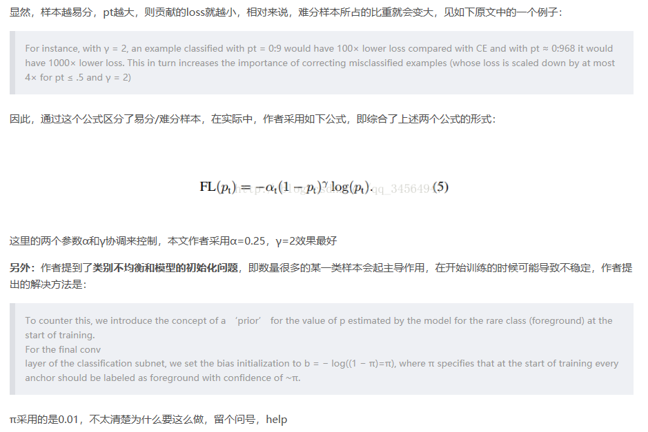

###Focal Loss

####1.主要解决的问题:  
&emsp;&emsp; Focal loss主要是为了解决one-stage目标检测中正负样本比例严重失衡的问题。该损失函数降低了大量简单负样本在训练中所占的权重，也可理解为一种困难样本挖掘。  
  

2.损失函数形式:  
&emsp;&emsp;Focal loss是在交叉熵损失函数基础上进行的修改，首先回顾二分类交叉熵损失：  
&emsp;&emsp;&emsp;    
3.Focal Loss
&emsp;&emsp;&emsp;&emsp;&emsp;  
a. 由于大多数都是简单易分的负样本（属于背景的样本），使得训练过程不能充分学习到属于那些有类别样本的信息；其次简单易分的负样本太多，可能掩盖了其他有类别样本的作用（这些简单易分  
的负样本仍产生一定幅度的loss，见下图蓝色曲线，数量多会对loss起主要贡献作用，因此就主导了梯度的更新方向，掩盖了重要的信息）  
b.  
C.

